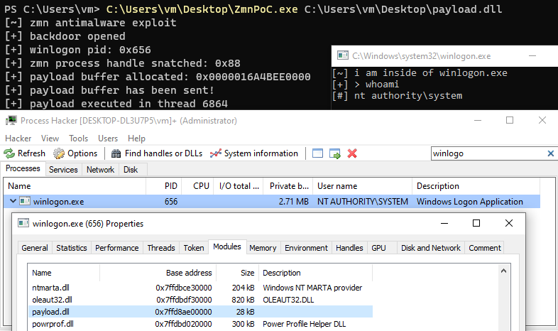

# ZemanaLPE

A proof-of-concept of local privilege escalation by exploiting Zemana AntiMalware/AntiLogger

# Usage

Make sure to use this on the virtual machine, I do not recommend to try this out on the physical machine.  
Also, this software provided without any kind of warranty. See [LICENSE](/LICENSE)

1. Download and Install Zemana [AntiMalware](https://www.zemana.com/antimalware) or [AntiLogger](https://www.zemana.com/antilogger).
2. (Optional) Restart your machine.
3. Run.

# License

MIT copyright (c) Kento Oki 2021  
See [LICENSE](/LICENSE)